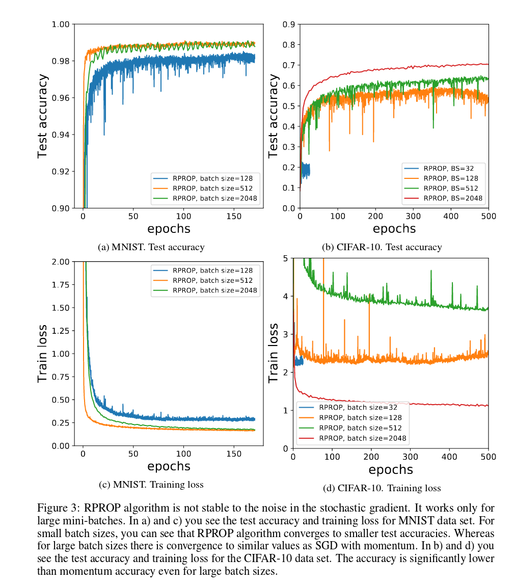
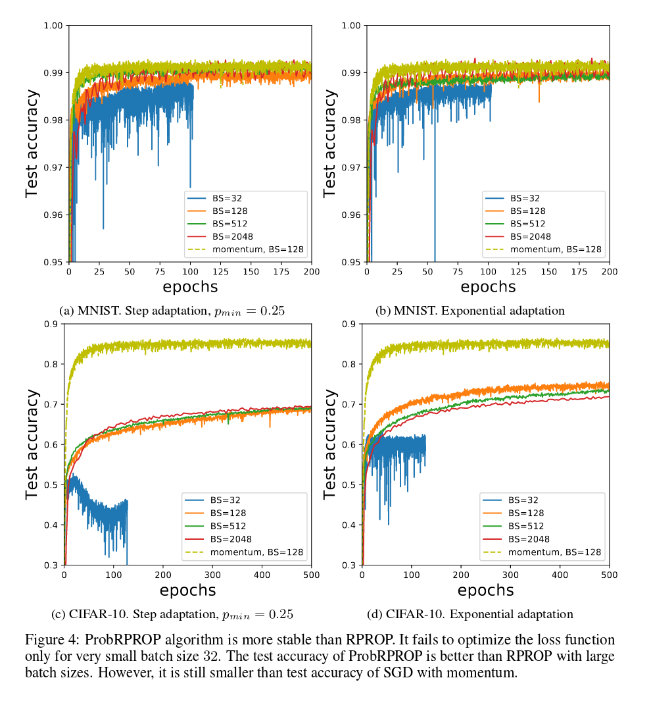

# ProbabilisticRPROP

Probabilistic version of Resilient propagation (RPROP) algorithm that is stable to noise in stochastic optimisation e.g.
during usage of mini-batches in loss estimation.

It is known that RPROP algorithm is not stable to noise as it relies on the sign of the gradients that can be different from
the sign of stochastic gradient that is used in stochastic optimisation. 
Below you see the results of our RPROP implementation. For CIFAR-10 dataset you can see how the performance of this algorithm 
depends on the variance of stochastic gradients (it is inversely proportional to the batch size)   

In contrast our version that scale adaptation factors according to the uncertainty in the sign change of gradient is stable to noise and works with small mini-batches (e.g. with size 128)

For more details look at the [full report](./report/ProbabilisticRPROP.pdf).
